# Pattern Oriented Software Design - Term Project

## DEI Dating System

Team members:

- 112598056 陳威廷
- 112598061 許喬睿
- 110590001 郭丞軒

## Disclaimer

1. The original intention of this project is to promote inclusivity and diversity. We sincerely apologize if any content is perceived as inappropriate or offensive, as this was never our intent.

2. This project should integrate with Database, but I'm too lazy to do that... so there might be some weird functions in the code.

## Problem Statement

Traditional dating applications often fail to accommodate the diverse spectrum of sexual orientations and gender identities, leaving many users unable to find suitable matches or fully express their authentic selves. This lack of inclusivity creates a barrier to meaningful connections and equitable participation in online dating platforms.

There is a need for an **DEI Dating System** that offers a comprehensive and affirming experience, enabling individuals of all gender identities and sexual orientations to connect authentically while fostering a safe and supportive environment.

## Description

The DEI Dating System is an inclusive online dating platform designed to embrace and celebrate the full spectrum of sexual orientations and gender identities. Our mission is to create a affirming and equitable space where individuals can express their authentic selves and form meaningful connections without the limitations imposed by traditional dating applications.

Key Features:

- Comprehensive Profile Creation: Users can create detailed profiles that accurately reflect their identities, including options for custom gender identities and sexual orientations.

- Customizable Preferences: The system provides advanced preference settings, enabling users to specify exactly what they are looking for in potential matches.

- Advanced Matching Algorithm: Utilizing sophisticated algorithms and design patterns, the DEI Dating System ensures that matches are made based on mutual preferences and compatibility. The matching engine considers both users' preferences, promoting equitable connections and reducing one-sided matches.

- Inclusivity and Diversity: By supporting custom identities and orientations, the system breaks down the barriers present in traditional dating apps. It acknowledges and embraces the diversity of its users, providing an inclusive environment where everyone feels seen and valued.

## Future

## Technique

- Jersey: RESTful Web Services
- Jetty: HTTP Server
- SLF4J: Logging
- React, Tailwind CSS: Frontend

## Design Patterns Summary & Storyboard

### Singleton Pattern

There are various of gender identities and sexual orientations in the DEI Dating System, and we need to handle complex relationships between them. We use the Singleton Pattern to initialize the default relationships between gender identities and sexual orientations. This ensures that there is only one instance of the relationship manager throughout the application.

Intricate relationships:

```java
public enum GenderIdentityEnum {
    MALE("Male"),
    FEMALE("Female"),
    NON_BINARY("Non-binary"),
    GENDERQUEER("Genderqueer"),
    AGENDER("Agender"),
    TRANSGENDER("Transgender"),
    GENDER_FLUID("Gender fluid"),
    TWO_SPIRIT("Two-spirit"),
    OTHER("Other"),
    CUSTOM("Custom")
}
```

```java
public enum SexualOrientation {
    HETEROSEXUAL,
    HOMOSEXUAL,
    BISEXUAL,
    PANSEXUAL,
    ASEXUAL,
    DEMISEXUAL,
    QUEER,
    OTHER,
}
```

Default mappings:

```java
    private void initializeDefaultMappings() {
        defaultMappings.put(SexualOrientation.HETEROSEXUAL, this::getOppositeGender);
        defaultMappings.put(SexualOrientation.HOMOSEXUAL, this::getSameGender);
        defaultMappings.put(SexualOrientation.BISEXUAL,
                gender -> List.of(new GenderIdentity(GenderIdentityEnum.MALE),
                        new GenderIdentity(GenderIdentityEnum.FEMALE)));
        defaultMappings.put(SexualOrientation.PANSEXUAL, gender -> this.getAllGenderIdentities());
        defaultMappings.put(SexualOrientation.ASEXUAL, gender -> this.getAllGenderIdentities());
        defaultMappings.put(SexualOrientation.DEMISEXUAL, gender -> this.getAllGenderIdentities());
        defaultMappings.put(SexualOrientation.QUEER, gender -> this.getAllGenderIdentities());
        defaultMappings.put(SexualOrientation.OTHER, gender -> this.getAllGenderIdentities());
    }
```

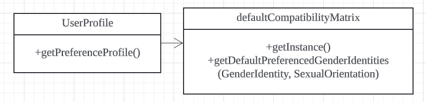

### Builder Pattern

Since the user profile in the DEI Dating System can be complex and contain multiple attributes, we use the Builder Pattern to create user profiles in a step-by-step manner. The builder pattern allows us to construct user profiles with different attributes and configurations, making it easy to create profiles with varying levels of detail.

```java
UserProfile alexProfile = new UserProfileBuilder()
                                .setName("Alex")
                                .setAge(20)
                                .setGenderIdentityWithEnum(GenderIdentityEnum.MALE)
                                .setSexualOrientation(SexualOrientation.HETEROSEXUAL)
                                .setInterests(List.of("Music"))
                                .build();
```

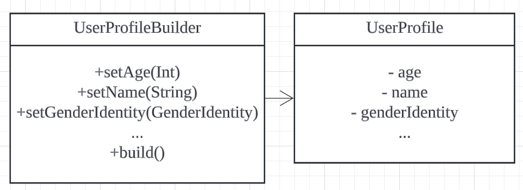

### Factory Method Pattern

The Factory Method Pattern is used to create instances of different types of users in the DEI Dating System. For example, we have different types of users such as basic users and premium users. By using the Factory Method Pattern, we can define a factory class that creates instances of these user types based on the user's role.

```java
UserFactory factory = new UserFactory();
UserProfile alexProfile = new UserProfileBuilder().build();
User basicUser = factory.createUser(alexProfile, false);
User premiumUser = factory.createUser(alexProfile, true);
```

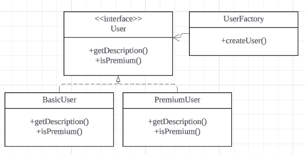

### Specification Pattern

In the DEI Dating System, users can specify their preferences for potential matches, including age range, interests, and other criteria. With the Specification Pattern, we can create a set of specifications that represent different preferences. These specifications can be combined using logical operators such as AND, OR to create more complex criteria.

For example, a user may specify that they are looking for matches who are interested in hiking and are within a certain age range. We can create such specifications like below:

```java
Specification<UserProfile> interestSpec = new InterestSpecification("hiking");
Specification<UserProfile> ageSpec = new AgeRangeSpecification(25, 35);
Specification<UserProfile> combinedSpec = interestSpec.and(ageSpec);
```

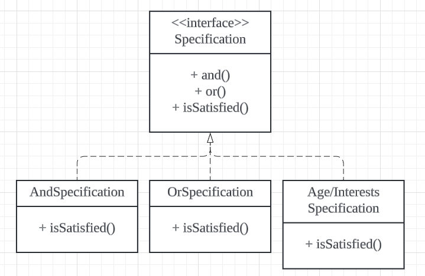

### Strategy Pattern

The matching algorithm is a crucial component of the DEI Dating System. By using the Strategy Pattern, we can define multiple algorithms for matching users based on different criteria. For instance, we have default matching algorithm and bi-directional matching algorithm. The system can switch between these algorithms at runtime, allowing users to choose the one that best suits their preferences.

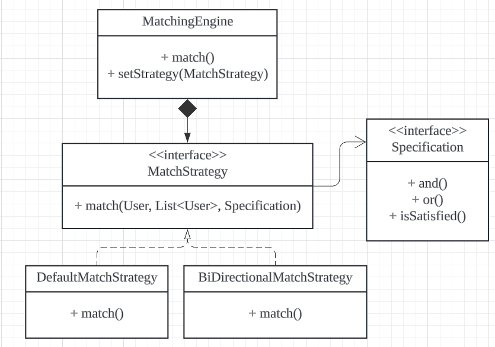

### MVC Architecture

Implement UserService to handle user requests from jersey and interact with the model.

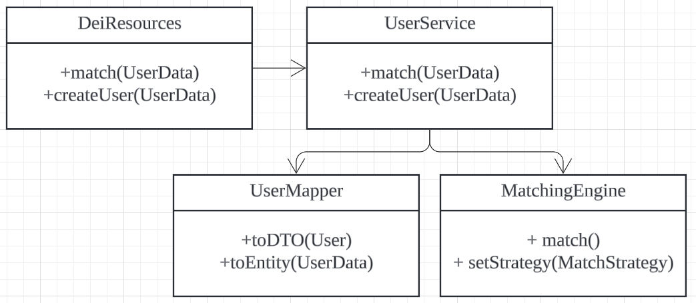

### DTO Pattern

The Data Transfer Object (DTO) Pattern is used to transfer data between the client and server in a structured and efficient manner. In the DEI Dating System, we define DTO classes to represent user profiles, preferences, and other data. These DTOs are serialized and deserialized to facilitate communication between the frontend and backend components.

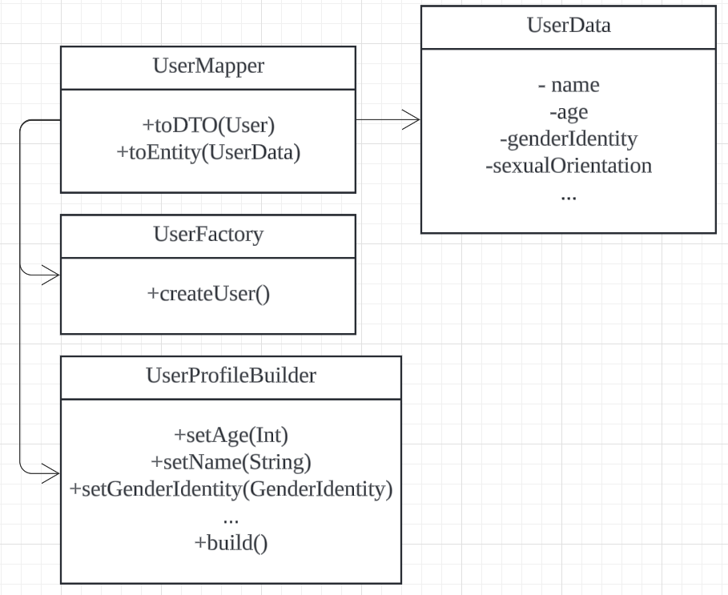

reference: [Patterns of Enterprise Application Architecture](https://martinfowler.com/eaaCatalog/dataTransferObject.html)

### Summary

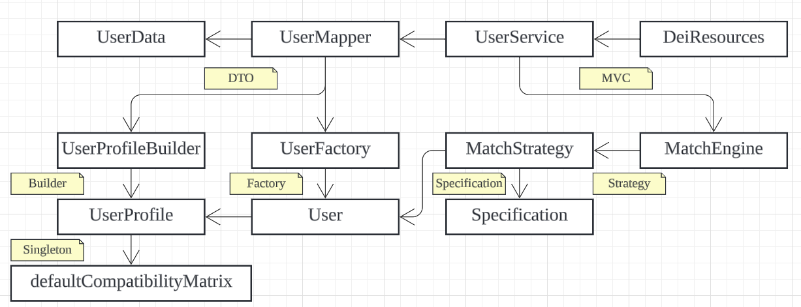

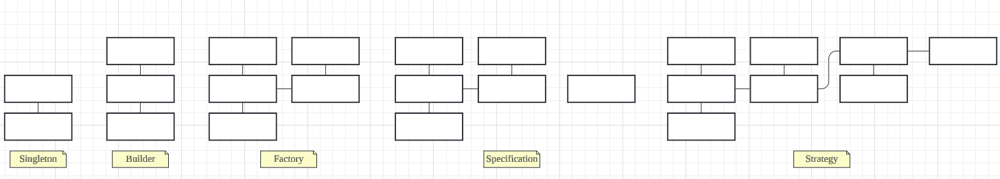
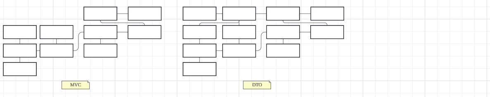

## Design Patterns in Our Code

1. Singleton Pattern
2. Builder Pattern
3. Factory Method Pattern
4. Specification Pattern
5. Strategy Pattern
6. MVC Architecture
7. DTO Pattern

## Sequence Diagram

### Create user

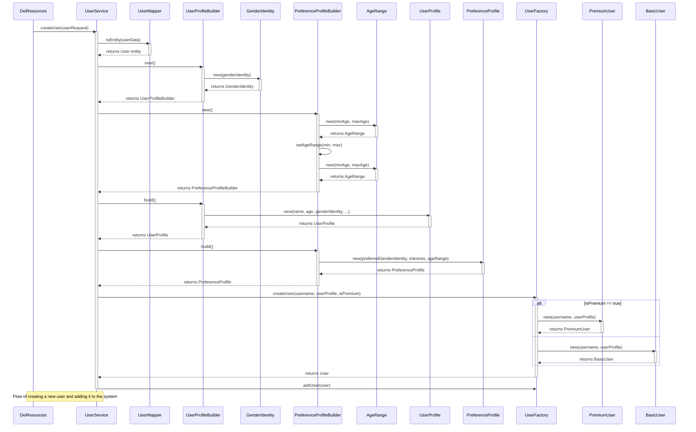

### Match users

```mermaid
sequenceDiagram
    participant DeiResources
    participant UserService
    participant UserMapper
    participant UserProfileBuilder
    participant GenderIdentity
    participant PreferenceProfileBuilder
    participant AgeRange
    participant UserProfile
    participant PreferenceProfile
    participant UserFactory
    participant PremiumUser
    participant BasicUser
    participant MatchingEngine
    participant MatchStrategy
    participant LambdaComparator
    participant userMapperToDTO as "UserMapper::toDTO"
    participant userData as "UserData"

    Note left of DeiResources: DeiResources.match(userRequest)
    DeiResources->>UserService: match(userRequest)
    activate UserService

    Note over UserService: 1) Convert DTO to <br/> User entity
    UserService->>UserMapper: toEntity(userRequest)
    activate UserMapper
    UserMapper-->>UserService: returns User
    deactivate UserMapper

    Note over UserService: 2) (Optional) Build profiles <br/> (UserProfile/PreferenceProfile)
    UserService->>UserProfileBuilder: new()
    activate UserProfileBuilder
    UserProfileBuilder->>GenderIdentity: new(genderIdentity)
    activate GenderIdentity
    GenderIdentity-->>UserProfileBuilder: returns GenderIdentity
    deactivate GenderIdentity
    UserProfileBuilder-->>UserService: returns UserProfileBuilder
    deactivate UserProfileBuilder

    UserService->>PreferenceProfileBuilder: new()
    activate PreferenceProfileBuilder
    PreferenceProfileBuilder->>AgeRange: new(minAge, maxAge)
    activate AgeRange
    AgeRange-->>PreferenceProfileBuilder: returns AgeRange
    deactivate AgeRange

    PreferenceProfileBuilder->>PreferenceProfileBuilder: setAgeRange(min, max)
    PreferenceProfileBuilder->>AgeRange: new(minAge, maxAge)
    activate AgeRange
    AgeRange-->>PreferenceProfileBuilder: returns AgeRange
    deactivate AgeRange
    PreferenceProfileBuilder-->>UserService: returns PreferenceProfileBuilder
    deactivate PreferenceProfileBuilder

    UserService->>UserProfileBuilder: build()
    activate UserProfileBuilder
    UserProfileBuilder->>UserProfile: new(name, age, genderIdentity, orientation, bio, interests)
    activate UserProfile
    UserProfile-->>UserProfileBuilder: returns UserProfile
    deactivate UserProfile
    UserProfileBuilder-->>UserService: returns UserProfile
    deactivate UserProfileBuilder

    UserService->>PreferenceProfileBuilder: build()
    activate PreferenceProfileBuilder
    PreferenceProfileBuilder->>PreferenceProfile: new(genderIdentities, interests, ageRange)
    activate PreferenceProfile
    PreferenceProfile-->>PreferenceProfileBuilder: returns PreferenceProfile
    deactivate PreferenceProfile
    PreferenceProfileBuilder-->>UserService: returns PreferenceProfile
    deactivate PreferenceProfileBuilder

    Note over UserService: 3) Create final User object <br/> (basic or premium)
    UserService->>UserFactory: createUser(username, userProfile, isPremium)
    activate UserFactory
    alt isPremium == true
        UserFactory->>PremiumUser: new(username, userProfile)
        activate PremiumUser
        PremiumUser-->>UserFactory: returns PremiumUser
        deactivate PremiumUser
    else
        UserFactory->>BasicUser: new(username, userProfile)
        activate BasicUser
        BasicUser-->>UserFactory: returns BasicUser
        deactivate BasicUser
    end
    UserFactory-->>UserService: returns User
    deactivate UserFactory

    Note over UserService: 4) Matching flow
    UserService->>MatchingEngine: new(candidates)
    activate MatchingEngine

    MatchingEngine->>MatchingEngine: match(user, specificationBuilder)
    activate MatchStrategy
    MatchStrategy-->>MatchingEngine: returns matchedUsers
    deactivate MatchStrategy

    MatchingEngine-->>UserService: returns matchedUsers
    deactivate MatchingEngine

    Note over UserService: 5) Sort or compare matches <br/> using a lambda
    UserService->>LambdaComparator: compare(u1, u2)
    activate LambdaComparator
    LambdaComparator-->>UserService: returns comparison result
    deactivate LambdaComparator

    Note over UserService: 6) Convert matched Users <br/> into DTOs
    UserService->>userMapperToDTO: toDTO(user)
    activate userMapperToDTO
    userMapperToDTO->>userData: new()
    deactivate userMapperToDTO
    userData-->>UserService: returns UserData

    UserService-->>DeiResources: returns List<UserData>
    deactivate UserService
 ```
