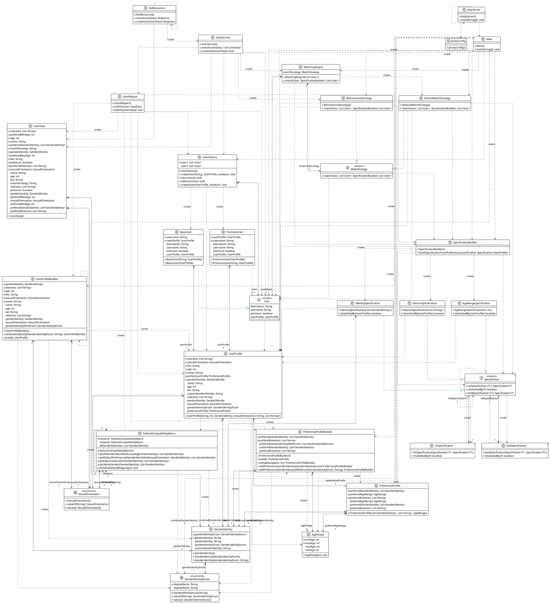

# Class Diagram

```plantuml
@startuml

!theme plain
top to bottom direction
skinparam linetype ortho

class AgeRange {
  + AgeRange(int, int): 
  - minAge: int
  - maxAge: int
   maxAge: int
   minAge: int
}
class AgeRangeSpecification {
  + AgeRangeSpecification(int, int): 
  + isSatisfiedBy(UserProfile): boolean
}
class AndSpecification<T> {
  + AndSpecification(Specification<T>, Specification<T>): 
  + isSatisfiedBy(T): boolean
}
class BasicUser {
  + BasicUser(String, UserProfile): 
  + BasicUser(UserProfile): 
  ~ username: String
  ~ userProfile: UserProfile
   description: String
   username: String
   premium: boolean
   userProfile: UserProfile
}
class BiDirectionalStrategy {
  + BiDirectionalStrategy(): 
  + match(User, List<User>, SpecificationBuilder): List<User>
}
class DefaultCompatibilityMatrix {
  - DefaultCompatibilityMatrix(): 
  - instance: DefaultCompatibilityMatrix
  - getAllGenderIdentitiesExcluding(GenderIdentity): List<GenderIdentity>
  + getDefaultPreferencedGenderIdentities(SexualOrientation, GenderIdentity): List<GenderIdentity>
  - getOppositeGender(GenderIdentity): List<GenderIdentity>
  - getSameGender(GenderIdentity): List<GenderIdentity>
  - initializeDefaultMappings(): void
   instance: DefaultCompatibilityMatrix
   allGenderIdentities: List<GenderIdentity>
}
class DefaultMatchStrategy {
  + DefaultMatchStrategy(): 
  + match(User, List<User>, SpecificationBuilder): List<User>
}
class DeiResources {
  + DeiResources(): 
  + match(UserData): Response
  + createUser(UserData): Response
}
class GenderIdentity {
  + GenderIdentity(): 
  + GenderIdentity(GenderIdentityEnum): 
  + GenderIdentity(GenderIdentityEnum, String): 
  - genderIdentityEnum: GenderIdentityEnum
  - genderIdentity: String
   genderIdentity: String
   genderIdentityEnum: GenderIdentityEnum
   customGenderIdentity: String
}
enum GenderIdentityEnum << enumeration >> {
  - GenderIdentityEnum(String): 
  - displayName: String
  + valueOf(String): GenderIdentityEnum
  + values(): GenderIdentityEnum[]
   displayName: String
}
class IdentitySpecification {
  + IdentitySpecification(List<GenderIdentity>): 
  + isSatisfiedBy(UserProfile): boolean
}
class InterestSpecification {
  + InterestSpecification(List<String>): 
  + isSatisfiedBy(UserProfile): boolean
}
class JerseyConfig {
  + JerseyConfig(): 
}
class JettyServer {
  + JettyServer(): 
  + main(String[]): void
}
class Main {
  + Main(): 
  + main(String[]): void
}
interface MatchStrategy << interface >> {
  + match(User, List<User>, SpecificationBuilder): List<User>
}
class MatchingEngine {
  + MatchingEngine(List<User>): 
  + match(User, SpecificationBuilder): List<User>
   matchStrategy: MatchStrategy
}
class OrSpecification<T> {
  + OrSpecification(Specification<T>, Specification<T>): 
  + isSatisfiedBy(T): boolean
}
class PreferenceProfile {
  + PreferenceProfile(List<GenderIdentity>, List<String>, AgeRange): 
  - preferedGenderIdentity: List<GenderIdentity>
  - preferedAgeRange: AgeRange
  - preferedInterests: List<String>
   preferedAgeRange: AgeRange
   preferedGenderIdentity: List<GenderIdentity>
   preferedInterests: List<String>
}
class PreferenceProfileBuilder {
  + PreferenceProfileBuilder(): 
  - preferedGenderIdentity: List<GenderIdentity>
  - preferedInterests: List<String>
  + build(): PreferenceProfile
  + setAgeRange(int, int): PreferenceProfileBuilder
  + addPreferenceGenderIdentity(GenderIdentityEnum): PreferenceProfileBuilder
  + addPreferenceGenderIdentityWithEnum(GenderIdentityEnum, String): PreferenceProfileBuilder
   preferedGenderIdentityWithEnum: List<GenderIdentityEnum>
   preferedGenderIdentity: List<GenderIdentity>
   preferedInterests: List<String>
}
class PremiumUser {
  + PremiumUser(UserProfile): 
  + PremiumUser(String, UserProfile): 
  - userProfile: UserProfile
  - username: String
   description: String
   username: String
   premium: boolean
   userProfile: UserProfile
}
enum SexualOrientation << enumeration >> {
  + SexualOrientation(): 
  + valueOf(String): SexualOrientation
  + values(): SexualOrientation[]
}
interface Specification<T> << interface >> {
  + or(Specification<T>): Specification<T>
  + isSatisfiedBy(T): boolean
  + and(Specification<T>): Specification<T>
}
class SpecificationBuilder {
  + SpecificationBuilder(): 
  + buildSpecificationFromPreferences(UserProfile): Specification<UserProfile>
}
interface User << interface >> {
   description: String
   username: String
   premium: boolean
   userProfile: UserProfile
}
class UserData {
  + UserData(): 
  - interests: List<String>
  - preferedMinAge: int
  - age: int
  - name: String
  - preferedGenderIdentity: List<GenderIdentity>
  - matchStrategy: String
  - genderIdentity: GenderIdentity
  - preferedMaxAge: int
  - bio: String
  - premium: boolean
  - preferedInterests: List<String>
  - sexualOrientation: SexualOrientation
   name: String
   age: int
   bio: String
   matchStrategy: String
   interests: List<String>
   premium: boolean
   genderIdentity: GenderIdentity
   preferedMaxAge: int
   sexualOrientation: SexualOrientation
   preferedMinAge: int
   preferedGenderIdentity: List<GenderIdentity>
   preferedInterests: List<String>
}
class UserFactory {
  - UserFactory(): 
  - users: List<User>
  + createUser(String, UserProfile, boolean): User
  + clearUsers(): void
  + addUser(User): void
  + createUser(UserProfile, boolean): User
   users: List<User>
}
class UserMapper {
  + UserMapper(): 
  + toDTO(User): UserData
  + toEntity(UserData): User
}
class UserProfile {
  + UserProfile(String, int, GenderIdentity, SexualOrientation, String, List<String>): 
  - interests: List<String>
  - sexualOrientation: SexualOrientation
  - bio: String
  - age: int
  - name: String
  - preferenceProfile: PreferenceProfile
  - genderIdentity: GenderIdentity
   name: String
   age: int
   bio: String
   customGenderIdentity: String
   interests: List<String>
   genderIdentity: GenderIdentity
   sexualOrientation: SexualOrientation
   genderIdentityEnum: GenderIdentityEnum
   preferenceProfile: PreferenceProfile
}
class UserProfileBuilder {
  + UserProfileBuilder(): 
  - genderIdentity: GenderIdentity
  - interests: List<String>
  - age: int
  - bio: String
  - sexualOrientation: SexualOrientation
  - name: String
  + setGenderIdentity(GenderIdentityEnum, String): UserProfileBuilder
  + build(): UserProfile
   name: String
   age: int
   bio: String
   interests: List<String>
   genderIdentity: GenderIdentity
   sexualOrientation: SexualOrientation
   genderIdentityWithEnum: GenderIdentityEnum
}
class UserService {
  + UserService(): 
  + match(UserData): List<UserData>
  + createUser(UserData): User
}

AgeRangeSpecification       -[#008200,dashed]-^  Specification              
AgeRangeSpecification       -[#595959,dashed]->  UserProfile                
AndSpecification            -[#008200,dashed]-^  Specification              
AndSpecification           "1" *-[#595959,plain]-> "leftSpecification\n1" Specification              
BasicUser                   -[#008200,dashed]-^  User                       
BasicUser                  "1" *-[#595959,plain]-> "userProfile\n1" UserProfile                
BiDirectionalStrategy       -[#008200,dashed]-^  MatchStrategy              
BiDirectionalStrategy       -[#595959,dashed]->  Specification              
BiDirectionalStrategy       -[#595959,dashed]->  SpecificationBuilder       
BiDirectionalStrategy       -[#595959,dashed]->  User                       
BiDirectionalStrategy       -[#595959,dashed]->  UserProfile                
DefaultCompatibilityMatrix  -[#595959,dashed]->  DefaultCompatibilityMatrix : "«create»"
DefaultCompatibilityMatrix "1" *-[#595959,plain]-> "instance\n1" DefaultCompatibilityMatrix 
DefaultCompatibilityMatrix  -[#595959,dashed]->  GenderIdentity             : "«create»"
DefaultCompatibilityMatrix  -[#595959,dashed]->  GenderIdentityEnum         
DefaultCompatibilityMatrix "1" *-[#595959,plain]-> "defaultMappings\n*" SexualOrientation          
DefaultMatchStrategy        -[#008200,dashed]-^  MatchStrategy              
DefaultMatchStrategy        -[#595959,dashed]->  Specification              
DefaultMatchStrategy        -[#595959,dashed]->  SpecificationBuilder       
DefaultMatchStrategy        -[#595959,dashed]->  User                       
DefaultMatchStrategy        -[#595959,dashed]->  UserProfile                
DeiResources                -[#595959,dashed]->  DeiResources               
DeiResources                -[#595959,dashed]->  UserData                   
DeiResources                -[#595959,dashed]->  UserService                : "«create»"
GenderIdentity             "1" *-[#595959,plain]-> "genderIdentityEnum\n1" GenderIdentityEnum         
IdentitySpecification      "1" *-[#595959,plain]-> "preferedGenderIdentities\n*" GenderIdentity             
IdentitySpecification       -[#008200,dashed]-^  Specification              
IdentitySpecification       -[#595959,dashed]->  UserProfile                
InterestSpecification       -[#008200,dashed]-^  Specification              
InterestSpecification       -[#595959,dashed]->  UserProfile                
JettyServer                 -[#595959,dashed]->  JerseyConfig               
JettyServer                 -[#595959,dashed]->  JettyServer                
JettyServer                 -[#595959,dashed]->  Main                       
Main                        -[#595959,dashed]->  BiDirectionalStrategy      : "«create»"
Main                        -[#595959,dashed]->  DefaultMatchStrategy       : "«create»"
Main                        -[#595959,dashed]->  GenderIdentityEnum         
Main                        -[#595959,dashed]->  MatchingEngine             : "«create»"
Main                        -[#595959,dashed]->  PreferenceProfile          
Main                        -[#595959,dashed]->  PreferenceProfileBuilder   : "«create»"
Main                        -[#595959,dashed]->  SexualOrientation          
Main                        -[#595959,dashed]->  SpecificationBuilder       : "«create»"
Main                        -[#595959,dashed]->  User                       
Main                        -[#595959,dashed]->  UserFactory                
Main                        -[#595959,dashed]->  UserProfile                
Main                        -[#595959,dashed]->  UserProfileBuilder         : "«create»"
MatchStrategy               -[#595959,dashed]->  SpecificationBuilder       
MatchStrategy               -[#595959,dashed]->  User                       
MatchingEngine              -[#595959,dashed]->  DefaultMatchStrategy       : "«create»"
MatchingEngine             "1" *-[#595959,plain]-> "matchingStrategy\n1" MatchStrategy              
MatchingEngine              -[#595959,dashed]->  SpecificationBuilder       
MatchingEngine             "1" *-[#595959,plain]-> "candidates\n*" User                       
OrSpecification             -[#008200,dashed]-^  Specification              
OrSpecification            "1" *-[#595959,plain]-> "leftSpecification\n1" Specification              
PreferenceProfile          "1" *-[#595959,plain]-> "preferedAgeRange\n1" AgeRange                   
PreferenceProfile          "1" *-[#595959,plain]-> "preferedGenderIdentity\n*" GenderIdentity             
PreferenceProfileBuilder    -[#595959,dashed]->  AgeRange                   : "«create»"
PreferenceProfileBuilder   "1" *-[#595959,plain]-> "ageRange\n1" AgeRange                   
PreferenceProfileBuilder   "1" *-[#595959,plain]-> "preferedGenderIdentity\n*" GenderIdentity             
PreferenceProfileBuilder    -[#595959,dashed]->  GenderIdentity             : "«create»"
PreferenceProfileBuilder    -[#595959,dashed]->  GenderIdentityEnum         
PreferenceProfileBuilder    -[#595959,dashed]->  PreferenceProfile          : "«create»"
PreferenceProfileBuilder    -[#595959,dashed]->  PreferenceProfileBuilder   
PremiumUser                 -[#008200,dashed]-^  User                       
PremiumUser                "1" *-[#595959,plain]-> "userProfile\n1" UserProfile                
Specification               -[#595959,dashed]->  AndSpecification           : "«create»"
Specification               -[#595959,dashed]->  OrSpecification            : "«create»"
Specification               -[#595959,dashed]->  Specification              
SpecificationBuilder        -[#595959,dashed]->  AgeRange                   
SpecificationBuilder        -[#595959,dashed]->  AgeRangeSpecification      : "«create»"
SpecificationBuilder        -[#595959,dashed]->  IdentitySpecification      : "«create»"
SpecificationBuilder        -[#595959,dashed]->  InterestSpecification      : "«create»"
SpecificationBuilder        -[#595959,dashed]->  PreferenceProfile          
SpecificationBuilder        -[#595959,dashed]->  Specification              
SpecificationBuilder        -[#595959,dashed]->  UserProfile                
User                        -[#595959,dashed]->  UserProfile                
UserData                   "1" *-[#595959,plain]-> "preferedGenderIdentity\n*" GenderIdentity             
UserData                   "1" *-[#595959,plain]-> "sexualOrientation\n1" SexualOrientation          
UserFactory                 -[#595959,dashed]->  BasicUser                  : "«create»"
UserFactory                 -[#595959,dashed]->  PremiumUser                : "«create»"
UserFactory                "1" *-[#595959,plain]-> "users\n*" User                       
UserFactory                 -[#595959,dashed]->  UserProfile                
UserMapper                  -[#595959,dashed]->  AgeRange                   
UserMapper                  -[#595959,dashed]->  PreferenceProfile          
UserMapper                  -[#595959,dashed]->  PreferenceProfileBuilder   : "«create»"
UserMapper                  -[#595959,dashed]->  User                       
UserMapper                  -[#595959,dashed]->  UserData                   : "«create»"
UserMapper                  -[#595959,dashed]->  UserFactory                
UserMapper                  -[#595959,dashed]->  UserProfile                
UserMapper                  -[#595959,dashed]->  UserProfileBuilder         : "«create»"
UserProfile                 -[#595959,dashed]->  DefaultCompatibilityMatrix 
UserProfile                "1" *-[#595959,plain]-> "genderIdentity\n1" GenderIdentity             
UserProfile                 -[#595959,dashed]->  GenderIdentityEnum         
UserProfile                "1" *-[#595959,plain]-> "preferenceProfile\n1" PreferenceProfile          
UserProfile                 -[#595959,dashed]->  PreferenceProfileBuilder   : "«create»"
UserProfile                "1" *-[#595959,plain]-> "sexualOrientation\n1" SexualOrientation          
UserProfileBuilder          -[#595959,dashed]->  GenderIdentity             : "«create»"
UserProfileBuilder         "1" *-[#595959,plain]-> "genderIdentity\n1" GenderIdentity             
UserProfileBuilder          -[#595959,dashed]->  GenderIdentityEnum         
UserProfileBuilder         "1" *-[#595959,plain]-> "sexualOrientation\n1" SexualOrientation          
UserProfileBuilder          -[#595959,dashed]->  UserProfile                : "«create»"
UserProfileBuilder          -[#595959,dashed]->  UserProfileBuilder         
UserService                 -[#595959,dashed]->  BiDirectionalStrategy      : "«create»"
UserService                 -[#595959,dashed]->  MatchingEngine             : "«create»"
UserService                 -[#595959,dashed]->  SpecificationBuilder       : "«create»"
UserService                 -[#595959,dashed]->  User                       
UserService                 -[#595959,dashed]->  UserData                   
UserService                 -[#595959,dashed]->  UserFactory                
UserService                 -[#595959,dashed]->  UserMapper                 
@enduml
```