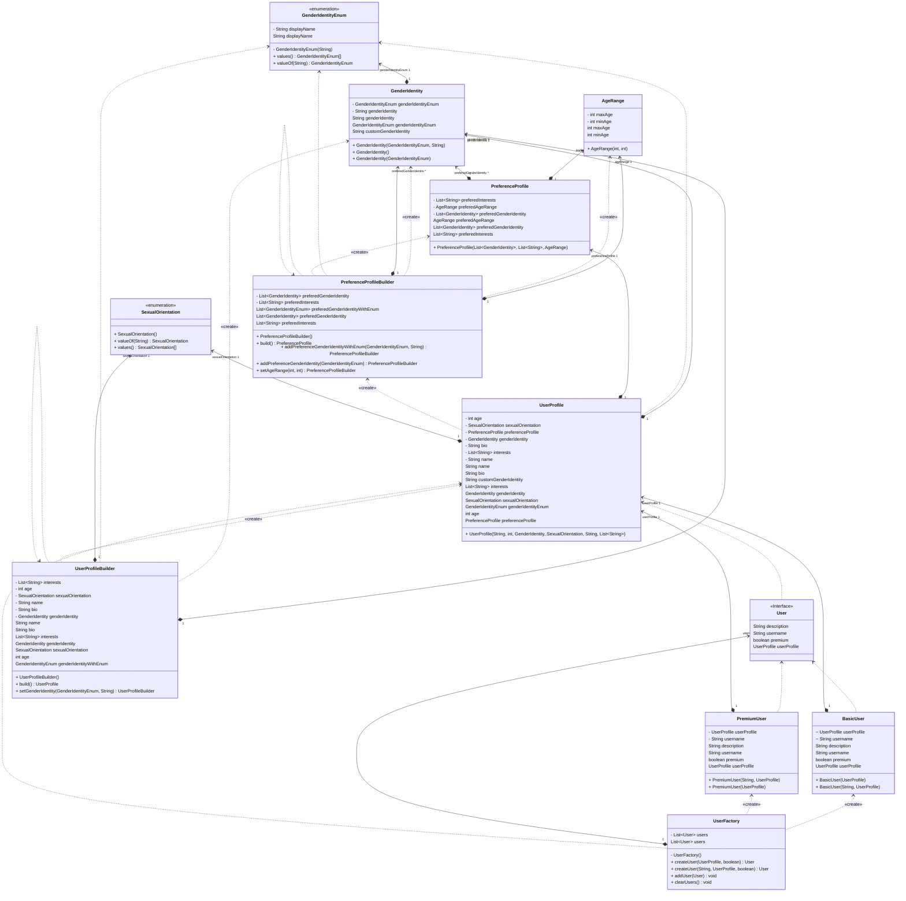
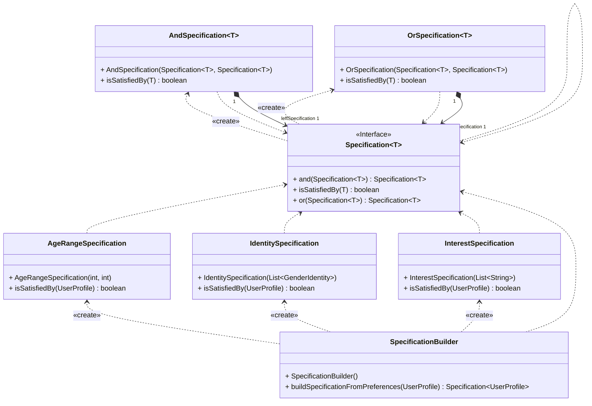
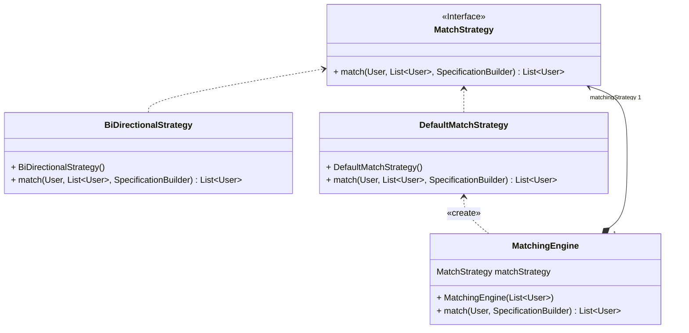
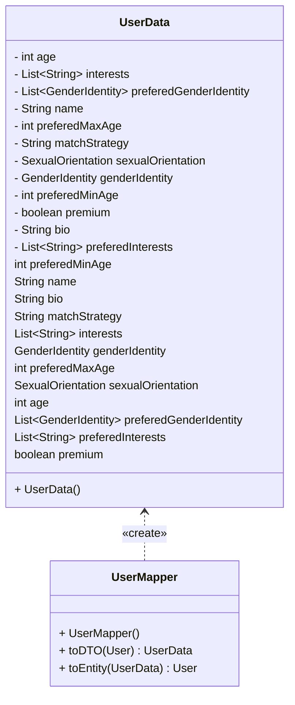

# Class Diagram

### Model

```mermaid
classDiagram
direction BT
class AgeRange {
  + AgeRange(int, int) 
  - int maxAge
  - int minAge
   int maxAge
   int minAge
}
class BasicUser {
  + BasicUser(UserProfile) 
  + BasicUser(String, UserProfile) 
  ~ UserProfile userProfile
  ~ String username
   String description
   String username
   boolean premium
   UserProfile userProfile
}
class GenderIdentity {
  + GenderIdentity(GenderIdentityEnum, String) 
  + GenderIdentity() 
  + GenderIdentity(GenderIdentityEnum) 
  - GenderIdentityEnum genderIdentityEnum
  - String genderIdentity
   String genderIdentity
   GenderIdentityEnum genderIdentityEnum
   String customGenderIdentity
}
class GenderIdentityEnum {
<<enumeration>>
  - GenderIdentityEnum(String) 
  - String displayName
  + values() GenderIdentityEnum[]
  + valueOf(String) GenderIdentityEnum
   String displayName
}
class PreferenceProfile {
  + PreferenceProfile(List~GenderIdentity~, List~String~, AgeRange) 
  - List~String~ preferedInterests
  - AgeRange preferedAgeRange
  - List~GenderIdentity~ preferedGenderIdentity
   AgeRange preferedAgeRange
   List~GenderIdentity~ preferedGenderIdentity
   List~String~ preferedInterests
}
class PreferenceProfileBuilder {
  + PreferenceProfileBuilder() 
  - List~GenderIdentity~ preferedGenderIdentity
  - List~String~ preferedInterests
  + build() PreferenceProfile
  + addPreferenceGenderIdentityWithEnum(GenderIdentityEnum, String) PreferenceProfileBuilder
  + addPreferenceGenderIdentity(GenderIdentityEnum) PreferenceProfileBuilder
  + setAgeRange(int, int) PreferenceProfileBuilder
   List~GenderIdentityEnum~ preferedGenderIdentityWithEnum
   List~GenderIdentity~ preferedGenderIdentity
   List~String~ preferedInterests
}
class PremiumUser {
  + PremiumUser(String, UserProfile) 
  + PremiumUser(UserProfile) 
  - UserProfile userProfile
  - String username
   String description
   String username
   boolean premium
   UserProfile userProfile
}
class SexualOrientation {
<<enumeration>>
  + SexualOrientation() 
  + valueOf(String) SexualOrientation
  + values() SexualOrientation[]
}
class User {
<<Interface>>
   String description
   String username
   boolean premium
   UserProfile userProfile
}
class UserFactory {
  - UserFactory() 
  - List~User~ users
  + createUser(UserProfile, boolean) User
  + createUser(String, UserProfile, boolean) User
  + addUser(User) void
  + clearUsers() void
   List~User~ users
}
class UserProfile {
  + UserProfile(String, int, GenderIdentity, SexualOrientation, String, List~String~) 
  - int age
  - SexualOrientation sexualOrientation
  - PreferenceProfile preferenceProfile
  - GenderIdentity genderIdentity
  - String bio
  - List~String~ interests
  - String name
   String name
   String bio
   String customGenderIdentity
   List~String~ interests
   GenderIdentity genderIdentity
   SexualOrientation sexualOrientation
   GenderIdentityEnum genderIdentityEnum
   int age
   PreferenceProfile preferenceProfile
}
class UserProfileBuilder {
  + UserProfileBuilder() 
  - List~String~ interests
  - int age
  - SexualOrientation sexualOrientation
  - String name
  - String bio
  - GenderIdentity genderIdentity
  + build() UserProfile
  + setGenderIdentity(GenderIdentityEnum, String) UserProfileBuilder
   String name
   String bio
   List~String~ interests
   GenderIdentity genderIdentity
   SexualOrientation sexualOrientation
   int age
   GenderIdentityEnum genderIdentityWithEnum
}

BasicUser  ..>  User 
BasicUser "1" *--> "userProfile 1" UserProfile 
GenderIdentity "1" *--> "genderIdentityEnum 1" GenderIdentityEnum 
PreferenceProfile "1" *--> "preferedAgeRange 1" AgeRange 
PreferenceProfile "1" *--> "preferedGenderIdentity *" GenderIdentity 
PreferenceProfileBuilder "1" *--> "ageRange 1" AgeRange 
PreferenceProfileBuilder  ..>  AgeRange : «create»
PreferenceProfileBuilder  ..>  GenderIdentity : «create»
PreferenceProfileBuilder "1" *--> "preferedGenderIdentity *" GenderIdentity 
PreferenceProfileBuilder  ..>  GenderIdentityEnum 
PreferenceProfileBuilder  ..>  PreferenceProfile : «create»
PreferenceProfileBuilder  ..>  PreferenceProfileBuilder 
PremiumUser  ..>  User 
PremiumUser "1" *--> "userProfile 1" UserProfile 
User  ..>  UserProfile 
UserFactory  ..>  BasicUser : «create»
UserFactory  ..>  PremiumUser : «create»
UserFactory "1" *--> "users *" User 
UserFactory  ..>  UserProfile 
UserProfile "1" *--> "genderIdentity 1" GenderIdentity 
UserProfile  ..>  GenderIdentityEnum 
UserProfile "1" *--> "preferenceProfile 1" PreferenceProfile 
UserProfile  ..>  PreferenceProfileBuilder : «create»
UserProfile "1" *--> "sexualOrientation 1" SexualOrientation 
UserProfileBuilder "1" *--> "genderIdentity 1" GenderIdentity 
UserProfileBuilder  ..>  GenderIdentity : «create»
UserProfileBuilder  ..>  GenderIdentityEnum 
UserProfileBuilder "1" *--> "sexualOrientation 1" SexualOrientation 
UserProfileBuilder  ..>  UserProfile : «create»
UserProfileBuilder  ..>  UserProfileBuilder 
```

### Specification

```mermaid
classDiagram
direction BT
class AgeRangeSpecification {
  + AgeRangeSpecification(int, int) 
  + isSatisfiedBy(UserProfile) boolean
}
class AndSpecification~T~ {
  + AndSpecification(Specification~T~, Specification~T~) 
  + isSatisfiedBy(T) boolean
}
class IdentitySpecification {
  + IdentitySpecification(List~GenderIdentity~) 
  + isSatisfiedBy(UserProfile) boolean
}
class InterestSpecification {
  + InterestSpecification(List~String~) 
  + isSatisfiedBy(UserProfile) boolean
}
class OrSpecification~T~ {
  + OrSpecification(Specification~T~, Specification~T~) 
  + isSatisfiedBy(T) boolean
}
class Specification~T~ {
<<Interface>>
  + and(Specification~T~) Specification~T~
  + isSatisfiedBy(T) boolean
  + or(Specification~T~) Specification~T~
}
class SpecificationBuilder {
  + SpecificationBuilder() 
  + buildSpecificationFromPreferences(UserProfile) Specification~UserProfile~
}

AgeRangeSpecification  ..>  Specification~T~ 
AndSpecification~T~  ..>  Specification~T~ 
AndSpecification~T~ "1" *--> "leftSpecification 1" Specification~T~ 
IdentitySpecification  ..>  Specification~T~ 
InterestSpecification  ..>  Specification~T~ 
OrSpecification~T~  ..>  Specification~T~ 
OrSpecification~T~ "1" *--> "leftSpecification 1" Specification~T~ 
Specification~T~  ..>  AndSpecification~T~ : «create»
Specification~T~  ..>  OrSpecification~T~ : «create»
Specification~T~  ..>  Specification~T~ 
SpecificationBuilder  ..>  AgeRangeSpecification : «create»
SpecificationBuilder  ..>  IdentitySpecification : «create»
SpecificationBuilder  ..>  InterestSpecification : «create»
SpecificationBuilder  ..>  Specification~T~ 
```

### Matching

```mermaid
classDiagram
direction BT
class BiDirectionalStrategy {
  + BiDirectionalStrategy() 
  + match(User, List~User~, SpecificationBuilder) List~User~
}
class DefaultMatchStrategy {
  + DefaultMatchStrategy() 
  + match(User, List~User~, SpecificationBuilder) List~User~
}
class MatchStrategy {
<<Interface>>
  + match(User, List~User~, SpecificationBuilder) List~User~
}
class MatchingEngine {
  + MatchingEngine(List~User~) 
  + match(User, SpecificationBuilder) List~User~
   MatchStrategy matchStrategy
}

BiDirectionalStrategy  ..>  MatchStrategy 
DefaultMatchStrategy  ..>  MatchStrategy 
MatchingEngine  ..>  DefaultMatchStrategy : «create»
MatchingEngine "1" *--> "matchingStrategy 1" MatchStrategy 
```

### DTO

```mermaid
classDiagram
direction BT
class UserData {
  + UserData() 
  - int age
  - List~String~ interests
  - List~GenderIdentity~ preferedGenderIdentity
  - String name
  - int preferedMaxAge
  - String matchStrategy
  - SexualOrientation sexualOrientation
  - GenderIdentity genderIdentity
  - int preferedMinAge
  - boolean premium
  - String bio
  - List~String~ preferedInterests
   int preferedMinAge
   String name
   String bio
   String matchStrategy
   List~String~ interests
   GenderIdentity genderIdentity
   int preferedMaxAge
   SexualOrientation sexualOrientation
   int age
   List~GenderIdentity~ preferedGenderIdentity
   List~String~ preferedInterests
   boolean premium
}
class UserMapper {
  + UserMapper() 
  + toDTO(User) UserData
  + toEntity(UserData) User
}

UserMapper  ..>  UserData : «create»
```