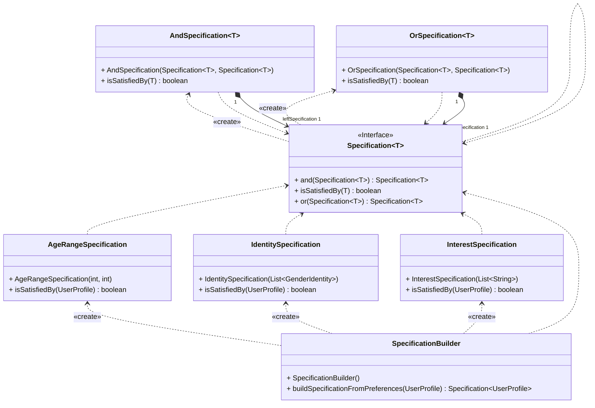
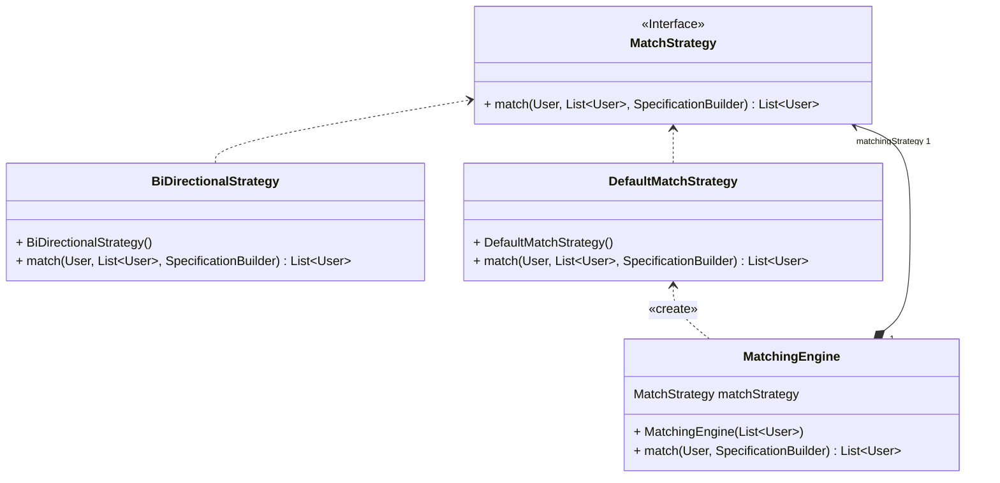
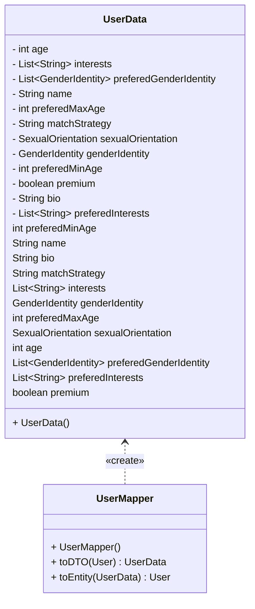

# Class Diagram

### Model
```mermaid
classDiagram
direction BT

class AgeRange {
    + AgeRange(int minAge, int maxAge)
    - int minAge
    - int maxAge
}

class BasicUser {
    + BasicUser(UserProfile userProfile)
    + BasicUser(String username, UserProfile userProfile)
    ~ UserProfile userProfile
    ~ String username
    ~ String description
    ~ boolean premium
}

class GenderIdentity {
    + GenderIdentity(GenderIdentityEnum genderIdentityEnum, String customGenderIdentity)
    + GenderIdentity()
    + GenderIdentity(GenderIdentityEnum genderIdentityEnum)
    - GenderIdentityEnum genderIdentityEnum
    - String genderIdentity
    - String customGenderIdentity
}

class GenderIdentityEnum {
<<enumeration>>
    - String displayName
    + values() GenderIdentityEnum[]
    + valueOf(String name) GenderIdentityEnum
}

class PreferenceProfile {
    + PreferenceProfile(List~GenderIdentity~ genderIdentities, 
                       List~String~ interests, 
                       AgeRange ageRange)
    - List~String~ preferedInterests
    - AgeRange preferedAgeRange
    - List~GenderIdentity~ preferedGenderIdentity
}

class PreferenceProfileBuilder {
    + PreferenceProfileBuilder()
    + addPreferenceGenderIdentityWithEnum(GenderIdentityEnum enumVal, String customValue) PreferenceProfileBuilder
    + addPreferenceGenderIdentity(GenderIdentityEnum enumVal) PreferenceProfileBuilder
    + setAgeRange(int minAge, int maxAge) PreferenceProfileBuilder
    + build() PreferenceProfile
    - List~GenderIdentityEnum~ preferedGenderIdentityWithEnum
    - List~GenderIdentity~ preferedGenderIdentity
    - List~String~ preferedInterests
}

class PremiumUser {
    + PremiumUser(String username, UserProfile userProfile)
    + PremiumUser(UserProfile userProfile)
    - UserProfile userProfile
    - String username
    - String description
    - boolean premium
}

class SexualOrientation {
<<enumeration>>
    + values() SexualOrientation[]
    + valueOf(String name) SexualOrientation
}

class User {
<<Interface>>
    String description
    String username
    boolean premium
    UserProfile userProfile
}

class UserFactory {
    - UserFactory()
    - List~User~ users
    + createUser(UserProfile userProfile, boolean premium) User
    + createUser(String username, UserProfile userProfile, boolean premium) User
    + addUser(User user) void
    + clearUsers() void
}

class UserProfile {
    + UserProfile(String name, int age, 
                  GenderIdentity genderIdentity, 
                  SexualOrientation sexualOrientation, 
                  String bio, 
                  List~String~ interests)
    - String name
    - int age
    - String bio
    - List~String~ interests
    - GenderIdentity genderIdentity
    - SexualOrientation sexualOrientation
    - PreferenceProfile preferenceProfile
}

class UserProfileBuilder {
    + UserProfileBuilder()
    + setGenderIdentity(GenderIdentityEnum enumVal, String customValue) UserProfileBuilder
    + build() UserProfile
    - String name
    - int age
    - String bio
    - List~String~ interests
    - GenderIdentity genderIdentity
    - SexualOrientation sexualOrientation
    - GenderIdentityEnum genderIdentityWithEnum
}

%% RELATIONSHIPS

BasicUser  ..>  User
BasicUser "1" *--> "userProfile 1" UserProfile

GenderIdentity "1" *--> "genderIdentityEnum 1" GenderIdentityEnum

PreferenceProfile "1" *--> "preferedAgeRange 1" AgeRange
PreferenceProfile "1" *--> "preferedGenderIdentity *" GenderIdentity

PreferenceProfileBuilder "1" *--> "ageRange 1" AgeRange
PreferenceProfileBuilder ..> AgeRange : «create»
PreferenceProfileBuilder ..> GenderIdentity : «create»
PreferenceProfileBuilder "1" *--> "preferedGenderIdentity *" GenderIdentity
PreferenceProfileBuilder ..> GenderIdentityEnum
PreferenceProfileBuilder ..> PreferenceProfile : «create»
PreferenceProfileBuilder ..> PreferenceProfileBuilder

PremiumUser ..> User
PremiumUser "1" *--> "userProfile 1" UserProfile

User ..> UserProfile

UserFactory ..> BasicUser : «create»
UserFactory ..> PremiumUser : «create»
UserFactory "1" *--> "users *" User
UserFactory ..> UserProfile

UserProfile "1" *--> "genderIdentity 1" GenderIdentity
UserProfile ..> GenderIdentityEnum
UserProfile "1" *--> "preferenceProfile 1" PreferenceProfile
UserProfile ..> PreferenceProfileBuilder : «create»
UserProfile "1" *--> "sexualOrientation 1" SexualOrientation

UserProfileBuilder "1" *--> "genderIdentity 1" GenderIdentity
UserProfileBuilder ..> GenderIdentity : «create»
UserProfileBuilder ..> GenderIdentityEnum
UserProfileBuilder "1" *--> "sexualOrientation 1" SexualOrientation
UserProfileBuilder ..> UserProfile : «create»
UserProfileBuilder ..> UserProfileBuilder

```

### Specification


### Matching


### DTO
